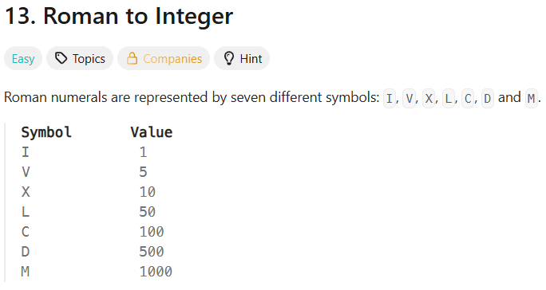
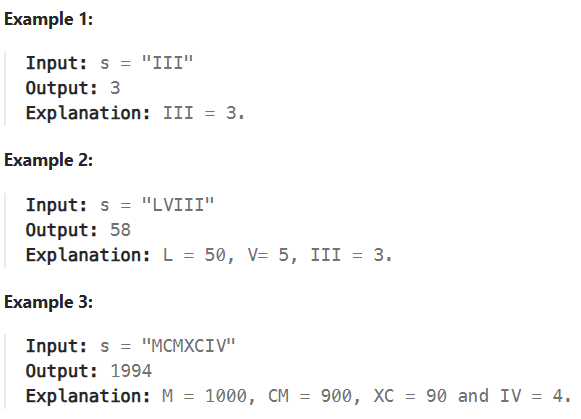
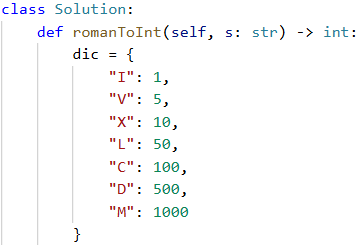
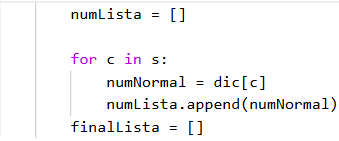
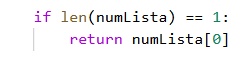
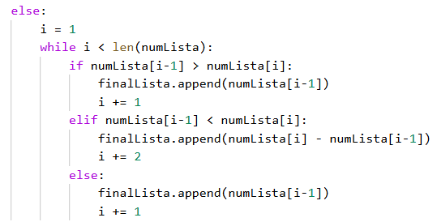
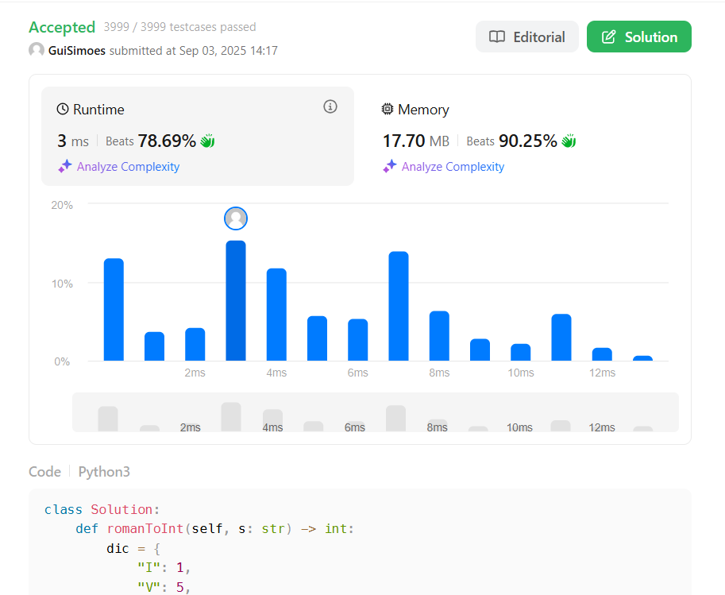

Roman To Integer
-
This problem was the one I spent the most time on so far. Not really because of its difficulty, but because of the conditions and the range issues inside loops. Most of the time I went out of range because I forgot how for and while loops actually work in terms of indexing in Python.
But regarding runtime and memory, my solution turned out very good — actually the best one so far.

The exercise asked us to implement a function that takes a string (a Roman numeral) as input and returns its value as an integer. The first idea I had was to create a dictionary with all the Roman numerals — just kidding, of course.
The problem statement itself helped a lot by giving us this image:

Roman numerals only use 7 symbols. So every Roman number is just a combination of these 7. That means all we really need is a dictionary with these 7 keys mapped to their integer values.

The next image show the idea of the problem and what our function need to do, with explanations that help a lot to get the central idea of the problem.

Step 1 – Create the dictionary
-
The first thing I did was to replicate the table in the problem statement as a dictionary in code. We need this dictionary to convert the input string into integers.

 
Step 2 – Create a list and add the numbers
-
As you can see in other problems, I have been working a lot with lists. Probably in future exercises I will need to use other data structures, but until now lists have been enough. (I know I will need to study other structures again later.)

Here I used a for loop to insert numbers into the list. Before inserting, we use the dictionary to convert each character from the string into its corresponding integer. Then we add that number to the list.

I also created another list (finalLista) because later in the exercise you’ll see why this problem looked easy at first, but then subtractions appeared and complicated things xD.

Step 3 - If the list as only one digit "I,V,X,L..."
-
This was actually the last part I added. When I submitted my first version on LeetCode, it failed on test cases where the input had only one character. The reason was that my while loop would “burn out” in that situation.

The fix was simple: if the list has only one number, we just return it directly. Since there’s only one element, we return numLista[0].

Step 4 - The main logic
-
Before we start this part I need you understand the next logic, you can understand when the number don't have any of the exceptions like this ones:

I can be placed before V (5) and X (10) to make 4 and 9.
X can be placed before L (50) and C (100) to make 40 and 90. 
C can be placed before D (500) and M (1000) to make 400 and 900.

The problem is easy, because we only need add all elements of the list,so, when the high numbers are always on the left:

The problem arises when a smaller number appears before a larger one, as in the exceptions IX or IV. In these cases, we can’t simply add the values together, because in Roman numerals a smaller value placed before a larger one indicates subtraction.

First, I used a while loop to iterate through numLista. The first condition I checked was whether the number at index [i-1] was greater than the number at index [i]. If it was, then we were in the “easy case”: I simply added that value to finalLista and incremented i by one, since in a while loop we control the iteration manually.

The second condition handled the subtraction case. If the value at [i-1] was smaller than the value at [i], then we needed to apply the subtraction rule. In that situation, I calculated numLista[i] - numLista[i-1], appended the result to finalLista, and incremented i by two, because both numbers had already been used to form that subtraction.

Finally, there was the case where two numbers were equal, meaning numLista[i-1] == numLista[i]. This worked similarly to the first condition: I just added the value to finalLista and moved on. Looking back now, I realize I could have simplified things by combining some of these cases with an "or".

Step 5 - Add the last value of the list (while things):
-
There was still a tricky situation: if the second-to-last value is larger than or equal to the last one, the while loop never actually processes the very last number.

Why? Because the loop condition is i < len(numLista). Since i starts at 1, by the time i reaches the last index, it is already equal to len(numLista), and the loop ends.

That’s why after the loop I added an extra condition: if the last number is less than or equal to the second-to-last, then we also need to add it to finalLista.

That part took time to understand, because when the second-to-last number was bigger than the last one, the result always came out lower than it should.

Submission LettCode:
-
First time that i have a good Runtime with python xD

